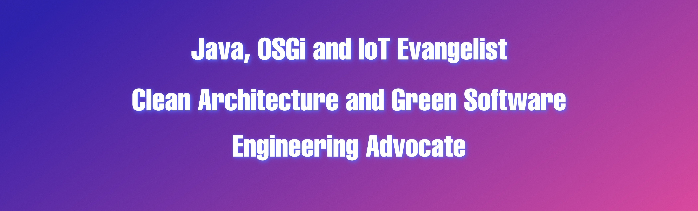

### 🌈 Hey there 👋🏻 Discover who I am and what makes me, me!

- 🏡 [MagentaZuhause](https://www.smarthome.de) Senior Engineer (formerly known as **Magenta SmartHome / QIVICON**)
- 🥷🏻 <b>Java</b>/<b>OSGi</b> Evangelist
- 🛟 Advocate for <b>Clean Architecture</b> and <b>Green Software Engineering</b> Practices
- 👨🏻‍💻 10+ Years of <b>OSGi</b> Experience in <b>IoT</b> Solutions ⇢ 🏠 <b>Smart Home</b> 🏭 <b>Industry 4.0</b>
- 🏭 [Kura Wires](https://eclipse.github.io/kura/wires/kura-wires-intro.html) Developer 📘 [Publication](https://www.amazon.de/Kura-Wires-Development-Component-managing/dp/6202205423)
- 🌓 [Eclipse Kura](https://github.com/eclipse/kura) and [Bndtools](https://github.com/bndtools/bnd) Committer
- 💻 Passionate <b>Open Source</b> Projects Contributor
- 🔉 <b>EclipseCon</b> Conference Speaker
- ✍🏼 DZone's <b>Most Valuable Blogger</b> (MVB)
- 🖥️ Actively developing [OSGi.fx](https://github.com/amitjoy/osgifx-console) - a user-friendly RCP application for managing remote OSGi runtimes
- 🖥️ Actively developing [OSGi Messaging](https://github.com/amitjoy/osgi-messaging) - Reference implementation of OSGi Messaging Specification
- 🤖 AI Enthusiast
- 💬 Ask me about <b>Java</b>, <b>OSGi</b>, <b>IoT</b>, <b>Software Architecture</b> and <b>Green Coding</b>
- ⛰ <b>Outdoor Hobby</b>: Travel Vlogging 📺 <b>YouTube</b> Channel: [Life Beyond Cage](https://www.youtube.com/lifebeyondcage)
- 💂‍♀️ <b>Fun Fact</b>: Football ⚽️ aficionado
