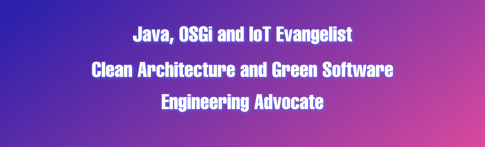

### Hi there! 👋 

I'm a Senior Software Engineer specializing in systems architecture, scalable IoT solutions, Agentic AI frameworks, and Green Software Engineering.

**🔭 Current Focus & Roles**
- 🏡 **Senior Software Engineer & Architect** at [MagentaZuhause](https://www.smarthome.de) (formerly Magenta SmartHome / QIVICON), driving system design, intent-based routing, and technical strategy.
- 🧠 **Architecting Agentic AI Solutions:** Designing sophisticated agentic workflows, Hierarchical Task Networks, and A2A communication using LangGraph, n8n, and OpenClaw/NanoClaw/IronClaw paradigms.
- 🌱 **Advancing Green Tech:** Developing infrastructure for Green-AI auditing.
- 🖥️ Actively developing [OSGi.fx](https://github.com/amitjoy/osgifx-console) — an extensible tooling framework and user-friendly RCP console for managing remote OSGi environments.
- 🖥️ Actively developing [OSGi Messaging](https://github.com/amitjoy/osgi-messaging) — Reference implementation of the OSGi Messaging Specification.

**💡 Core Expertise & Passions**
- 🏗️ **Systems Architecture & Design:** Championing **Clean Architecture** and robust infrastructure design for complex modern software ecosystems.
- 🥷🏻 **Java / OSGi Evangelist:** 13+ years of experience building scalable **IoT** Solutions (🏠 Smart Home | 🏭 Industry 4.0).
- 🤖 **AI & LLMOps:** Deeply passionate about the architectural integration of Artificial Intelligence into enterprise environments.
- 🛟 **Green Software Engineering:** Dedicated to sustainable coding practices, tracking software energy consumption, and optimizing AI resource usage.

**🌍 Open Source & Community**
- 🌓 **Committer:** [Eclipse Kura](https://github.com/eclipse/kura) and [Bndtools](https://github.com/bndtools/bnd)
- 🏭 **Creator & Author:** [Kura Wires](https://eclipse.github.io/kura/wires/kura-wires-intro.html) Developer | 📘 Published as a book on [Amazon](https://www.amazon.de/Kura-Wires-Development-Component-managing/dp/6202205423)
- 🔉 **Speaker:** EclipseCon/OCX Conference Speaker
- ✍🏼 **Author:** DZone's Most Valuable Blogger (MVB)

**⚡ Let's Connect!**
- 💬 **Ask me about:** Systems Architecture, Agentic AI, Java, OSGi, IoT, and Green Coding.
- ⛰️ **Outside of Tech:** I'm an outdoor enthusiast and travel vlogger. Check out my 📺 **YouTube Channel:** [Life Beyond Cage](https://www.youtube.com/lifebeyondcage)
- ⚽ **Fun Fact:** I'm a massive Football, Badminton 🏸, and Carrom 🎯 aficionado!
